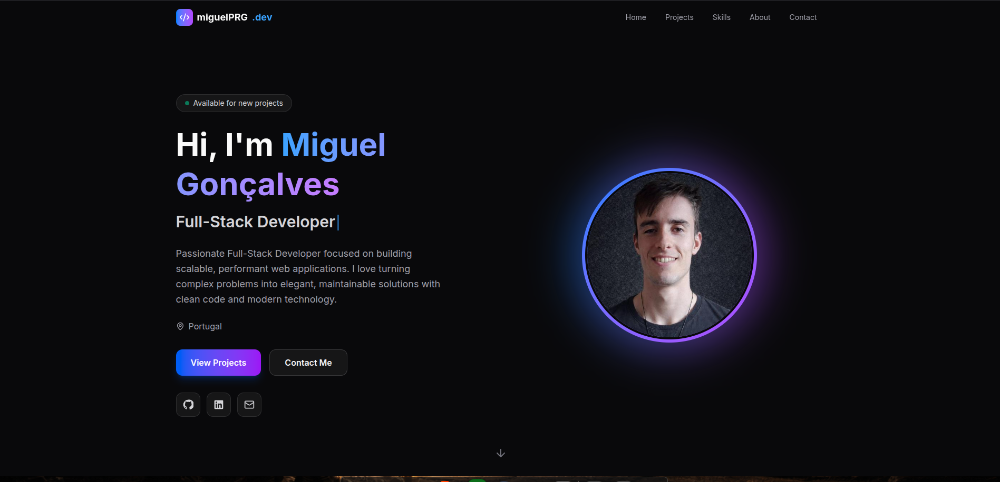

# Miguel Rodrigues Portfolio

This is a modern, single-page portfolio built to present my work, skills, and contact details in a clean and responsive layout. The site is designed as a polished developer showcase with a strong visual hierarchy, animated sections, and live project data pulled from GitHub when available.

## Preview



## How it works

The application is split into a React frontend and a small Express backend.

The frontend is a portfolio landing page with these sections:

- A hero section with my name, role, and call to action.
- A projects section that highlights pinned GitHub repositories.
- A skills section with the main technologies I work with.
- An about section with background and timeline information.
- A contact section with direct links and a message form.

The projects section first tries to load live pinned repositories from GitHub. If that fails, it falls back to curated local project data so the portfolio still renders correctly offline or when the API is unavailable.

The contact form sends messages through the Express backend. The backend validates the input, applies rate limiting, checks the request origin, and forwards the message through Brevo email delivery.

## Tech Stack

- React 19
- TypeScript
- Vite
- Tailwind CSS
- Express 5
- Zod
- React Hook Form
- Sonner for notifications
- Lucide React for icons
- dotenv for server configuration

## Getting Started

```bash
npm install
npm run dev
```

`npm run dev` starts both the frontend and the Express server.

### Server configuration

Create a `server/.env` file with the following variables:

```env
PORT=3001
CLIENT_ORIGIN=http://localhost:5173
BREVO_API_KEY=your-brevo-api-key
CONTACT_TO_EMAIL=your-email@example.com
```

### Useful scripts

```bash
npm run dev        # Start client and server together
npm run server     # Start only the Express API
npm run server:dev # Start the API with file watching
npm run build      # Build the production frontend
npm run preview    # Preview the production build locally
npm run lint       # Run ESLint
```

## Project Structure

```text
src/
├── components/   # Portfolio sections and shared UI pieces
├── data/         # Profile, projects, skills, and timeline content
├── hooks/        # Reusable React hooks
├── lib/          # GitHub integration and small utilities
├── App.tsx       # Main page composition
├── main.tsx      # Application entry point
└── index.css     # Global styles
server/
└── index.js      # Contact endpoint and Brevo integration
```

## Notes

- The projects section is data-driven and can render live GitHub content or a local fallback set.
- The contact form submits to `/api/contact`, so the frontend and backend should run together in development.
- If you want to update the screenshot, replace `screenshot.png` in the repository root.
